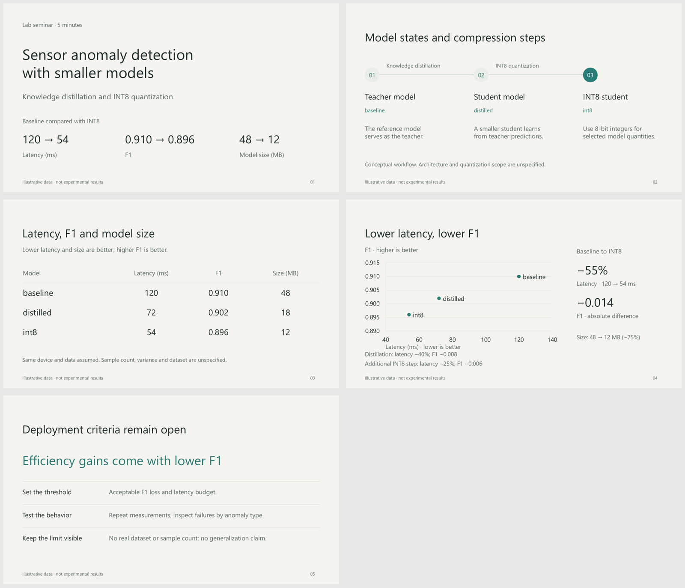

# PPT Art Director

[](https://github.com/ChihyunAhn0309/ppt-art-director/actions/workflows/validate.yml)

A reusable agent skill for clear, polished, editable PowerPoint presentations: researched visual references, precise slide planning, considered typography, topic-specific colors and purposeful native animation. Designed especially for research talks, paper seminars and technical presentations, with **English and Korean support**.

The product is **[SKILL.md](SKILL.md) and its supporting references and helpers**. The agent uses its available presentation tools; this repository is not a hosted generation service or a bundled presentation engine.

## Real presentation example



| Edition | Animated PPTX | Static PPTX | Preview |
|---|---|---|---|
| English | [Download](examples/research-seminar/animated.pptx) | [Download](examples/research-seminar/static.pptx) | [View](examples/research-seminar/preview.png) |
| Korean | [Download](examples/research-seminar/animated-ko.pptx) | [Download](examples/research-seminar/static-ko.pptx) | [View](examples/research-seminar/preview-ko.png) |

[Slide-by-slide plan](examples/research-seminar/slide-plan.md) · [Design decisions and verification](examples/research-seminar/README.md)

This five-minute research seminar uses **fictional data**, not experimental findings. The editions use a topic-first typographic opening, an editable process, a neutral comparison table and a native latency–F1 scatter plot. There is no decorative cover image. Visual hierarchy explains the content; it does not imply an unsupported winning model. English and Korean copy are fitted separately, including a single-line closing takeaway. Previews show the saved PPTX rendered in Microsoft PowerPoint.

## What the skill does

- Allocates required evidence before styling; researches references that solve the actual comparison or explanation problem.
- Adapts [paper-figure principles](references/research-visuals.md): meaning before geometry, traceable relationships, editable explanation and saved-slide review. Decorative art is not required.
- Records what was visually inspected and how it changes the deck; selects suitable [free tools](references/free-tools.md) for diagrams, scientific plots, vectors and editable PPTX production.
- Chooses a palette for the subject or follows supplied brand colors; includes 12 original palettes and an explicit color-pair contrast checker.
- Writes a file with the exact copy, evidence, layout, notes, timing and motion for every slide.
- **Waits for feedback by default.** Produces the deck when the user asks to proceed with that feedback.
- Supports explicit **one-shot** delivery with the same planning and quality checks, without an intermediate review pause.
- Makes titles and takeaways fit deliberately: concise copy, suitable space, modest size adjustments and semantic line breaks. A text box that does not overflow can still be poorly composed.
- Uses the requested output language, independently of the source or conversation language. Localizes labels, caveats and speaker notes, then checks each edition separately.
- Preserves editability where supported and requires visual inspection of every final slide.
- Adds native motion when it explains a sequence. The bundled helper supports Fade, Appear, click groups and Fade transitions in Windows PowerPoint.

## Installation

Place the complete folder containing `SKILL.md` in the skill directory supported by your agent. For current Codex installations, use `$HOME/.agents/skills/ppt-art-director` for user-wide access or `.agents/skills/ppt-art-director` in a project. See the [official skill documentation](https://learn.chatgpt.com/docs/build-skills).

```text
.agents/skills/ppt-art-director/
  SKILL.md
  agents/
  assets/
  references/
  scripts/
```

Repository documentation, tests and examples may remain in the folder. Avoid duplicate registrations of an existing installation; restart the agent if the skill is not listed. Other agents have their own installation conventions, and automatic discovery there has not been verified.

## Usage

Start with a reviewable plan:

```text
$ppt-art-director
Plan a 12-slide English lab seminar from the attached paper.
The audience is graduate researchers; the talk is 15 minutes.
Use a refined, restrained design. Show the exact content of each slide
in a plan file and wait for my feedback before producing the PPTX.
```

Apply feedback and build:

```text
Clarify the method on S03 as two steps. Make S06 a comparison table.
Keep 12 slides and the agreed visual direction.
Apply this feedback and produce the final editable presentation.
```

One-shot delivery:

```text
$ppt-art-director
Create an eight-slide, ten-minute technical talk in one shot.
Use the attached material and choose a palette appropriate to the topic.
Make separate English and Korean editions. Fit the copy in each language.
Use click-driven animation only where it clarifies the method.
Do not invent missing results, uncertainty estimates or citations.
```

## Runtime and support boundaries

| Capability | Requirement | Boundary |
|---|---|---|
| Planning, design and feedback | Agent with file access; browsing for current references | Model and source quality affect results |
| Editable PPTX production | Host presentation tools or a documented PPTX library | No authoring engine is bundled |
| Palette and package checks | Python 3.10+, standard library | Not complete accessibility, OOXML or design validation |
| Visual review | A renderer and image inspection tools | Passing structural checks does not establish visual quality |
| Bundled native animation | Windows, PowerShell, installed and licensed Microsoft PowerPoint | Does not attach to a running user PowerPoint session |

When the host supplies a Presentations skill, follow that workflow. Otherwise, use an available documented tool such as [PptxGenJS](https://gitbrent.github.io/PptxGenJS/). This skill does not require a particular private runtime or paid model API.

The animation helper does not implement Morph, motion paths, paragraph-level or chart-series animation. Planning and static production remain useful without Windows PowerPoint. Saved effect settings and visually observed slideshow playback are separate checks. See [motion support](references/motion.md).

## Helpers and validation

Run from the repository root:

```shell
python scripts/palette_check.py assets/palettes.json
python scripts/pptx_audit.py path/to/deck.pptx --expect-slides 8 --output work/audit.json
python -m unittest discover -s tests -v
python scripts/verify_checksums.py examples/research-seminar/checksums.json
```

Use `-DryRun` to validate a motion plan against the exported file before applying it. [Motion syntax and commands](references/motion.md)

[VALIDATION.md](VALIDATION.md) records independent tests, defects fixed, subsequent redesign review and unverified areas. [Behavioral scenarios](tests/scenarios.md) support fresh-session testing. GitHub Actions checks helpers, exact published-file checksums and the example packages on Windows and Ubuntu; it does not render slides or assess aesthetics.

## References and original implementation

The research includes Anthropic's public PPTX skill, Google's official Gemini and Slides documentation, MiniMax and other public implementations, Pitch, Slidesgo, Canva, MIT Communication Lab and Microsoft PowerPoint guidance. The [source ledger](references/sources.md) and [design reference library](references/reference-library.md) distinguish inspected material, borrowed principles and unavailable internals.

This is an original implementation. It does not redistribute Anthropic skill code or claim access to Google's private presentation-generation skill. No controlled Claude-versus-Gemini-versus-Codex quality benchmark was conducted. External templates and fonts retain their own terms. The example workflow also follows the user-requested [paper-figure](https://github.com/JYS1025/paper-figure) process; its tools are not bundled or required for general use.

## Package map

| Path | Purpose |
|---|---|
| [SKILL.md](SKILL.md) | Entry point and workflow |
| [Planning template](assets/slide-plan-template.md) | Exact slide specifications and feedback record |
| [Design](references/design.md) | Composition, palette and evidence presentation |
| [Typography](references/typography.md) | Deliberate line fitting and language-specific checks |
| [Free tools](references/free-tools.md) | Task-specific tool choices, editable-source boundaries and zero-purchase routes |
| [Research visuals](references/research-visuals.md) | Content-driven research figures and paper-figure adaptation |
| [Research talks](references/research-talks.md) | Papers, experiments, equations and scientific figures |
| [Production](references/production.md) | Tool selection and deliverables |
| [Quality](references/quality.md) | Content, editability, rendering and motion review |
| `scripts/` | Contrast, PPTX package and native-motion helpers |
| `tests/` | Helper regressions and behavioral scenarios |
| [Example](examples/research-seminar/README.md) | English/Korean PPTX files, renders and inspection evidence |

## License

[MIT License](LICENSE). Third-party references retain their own rights; this license does not relicense external skills, templates, fonts or images.
