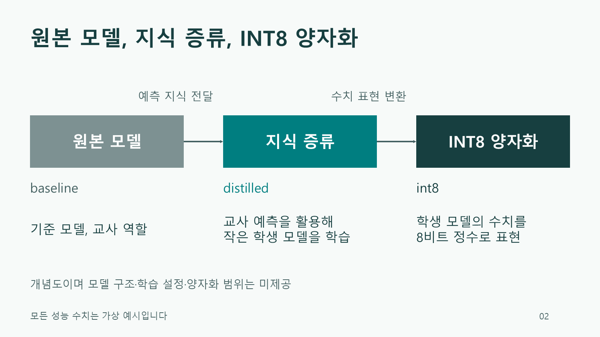

# 원샷 연구 발표 예시와 도식 검증

[애니메이션 PPTX](animated.pptx) · [정적 PPTX](static.pptx) · [기획안](slide-plan.md) · [전체 미리보기](preview.png)

독립 세션에서 `ppt-art-director`로 제작한 한국어 5장·5분 발표입니다. 주어진 가상 센서 모델 데이터를 설명하며, 실제 연구 결과나 Claude·Gemini와의 비교 평가를 의미하지 않습니다. 시각 예시는 저장된 애니메이션 PPTX를 Microsoft PowerPoint로 렌더링한 최종 상태입니다. 글꼴은 맑은 고딕이며 임베딩하지 않았습니다.

공개용 애니메이션 PPTX에서는 `docProps/core.xml`의 Office 최종 수정자 필드만 제거했습니다. 슬라이드·차트·내장 데이터·애니메이션을 포함한 다른 ZIP part는 원래 검증 파일과 바이트가 동일합니다. 미리보기와 앱 편집 검증은 그 원본에서 수행했으며, 메타데이터 제거 후 공개 파일의 패키지·도식 검사를 다시 실행했습니다. 원본과 공개본 해시 및 변경 범위는 [데이터 검사 기록](data-check.json)에 남겼습니다.

## 사용한 입력

같은 장치·데이터라는 조건으로 다음 가상 값을 제공했습니다. 표본수·분산·실제 데이터셋·모델 구조·학습 설정은 제공하지 않았습니다. baseline → distilled → int8의 과정을 편집 가능한 도식으로 설명하고, 청록색의 절제된 디자인과 필요한 클릭 애니메이션을 요청했습니다.

| 모델 | 지연 (ms) | F1 | 모델 크기 (MB) |
|---|---:|---:|---:|
| baseline | 120 | 0.910 | 48 |
| distilled | 72 | 0.902 | 18 |
| int8 | 54 | 0.896 | 12 |

## paper-figure로 추가 검토한 S02



사용자가 지정한 [paper-figure](https://github.com/JYS1025/paper-figure/blob/363fb3b76003d919f797356d774e70161164a7a8/skills/paper-figure/SKILL.md)의 **기존 파일 검토 경로**를 적용했습니다. 기존 PPTX의 내용과 연결 관계를 검토했으며, 새 그림 생성이나 이미지 모델 초안·재구성 과정은 수행하지 않았습니다.

관계 명세는 원래 요청의 세 단계와 두 방향 연결을 기준으로 작성했습니다. 각 상자는 설명 단계, 각 화살표는 교사 예측의 전달 또는 수치 표현의 변환을 뜻합니다. 텐서 모양·채널 수·추론 경로·양자화 범위는 추가로 추정하지 않았습니다. baseline/distilled/int8 식별자는 표와 차트에서도 유지합니다.

| 검사 | 관찰과 범위 |
|---|---|
| 필수 내용 | [도식 명세](diagram-contract.json)의 단계명·모델명 6개가 저장된 개체와 일치 |
| 방향·편집 가능한 개체 | 원본 → 증류 → INT8의 두 native connector, S02의 텍스트 도형 15개, 이미지 0개 |
| 부착 위치 | 두 연결의 양 끝이 보이는 상자 경계에 연결; 끝점 오차 0px, 자동 검토 경고 0건 |
| 렌더 검토 | PowerPoint 1600×900 렌더와 전체 미리보기에서 왼쪽→오른쪽 화살표, 라벨 연결, 본문 줄바꿈·잘림을 확인 |
| 표현의 한계 | 개념도라는 표시와 미제공 조건을 유지; 색만으로 단계를 구분하지 않고 이름·위치로도 구분 |

기계 검사의 원본 결과에서 로컬 파일 경로만 저장소 상대 경로로 바꾸어 [inspect 결과](diagram-inspect.json)와 [flow audit](flow-audit.json)에 보관했습니다. 자동 검사는 의미·미감을 판정하지 않으며, 이 검토는 논문 인쇄 크기의 가독성 평가가 아닌 발표 화면·미리보기 검토입니다. 읽기 전용 검사 전후 PPTX의 SHA-256은 동일합니다.

## 데이터·편집·애니메이션 검사

- [데이터 검사](data-check.json): 표의 원자료, 차트의 120/72/54, 내장 워크북, 55%·75% 감소와 F1 0.014 하락 계산을 확인했습니다.
- [PowerPoint 검사](powerpoint-check.json): 5장 렌더 및 사본에서 텍스트·표·차트·도식 수정 후 저장·재열기를 확인했습니다.
- [모션 계획](motion-plan.json): S02의 Fade 10개가 두 클릭 그룹에 속합니다. 저장 후 재열어 효과·대상·순서·트리거·시간을 확인했습니다. 실제 슬라이드 쇼 시각 재생은 검증하지 않았으며 `playbackVerified`는 `false`입니다.
- [파일 해시](checksums.json): PPTX와 미리보기를 다운로드한 뒤 해당 바이트를 확인할 수 있습니다. 정적판에는 설명 개체가 모두 표시됩니다.

## 재현 명령

스킬 저장소 루트에서 번들 검사기를 실행합니다.

```shell
python scripts/pptx_audit.py examples/research-seminar/animated.pptx --expect-slides 5
python scripts/pptx_audit.py examples/research-seminar/static.pptx --expect-slides 5
```

`paper-figure`를 위 리비전으로 별도 내려받고 Python의 `lxml` 의존성을 준비한 경우, 아래 경로의 `PATH_TO_PAPER_FIGURE`를 실제 체크아웃 경로로 바꿉니다. 도구는 이 저장소에 포함하지 않았으며 일반 스킬 사용의 필수 의존성도 아닙니다. 새 보고서 경로를 사용하세요.

```shell
python PATH_TO_PAPER_FIGURE/skills/paper-figure/scripts/pptx.py inspect examples/research-seminar/animated.pptx --contract examples/research-seminar/diagram-contract.json --output new-inspect.json
python PATH_TO_PAPER_FIGURE/skills/paper-figure/scripts/flow_audit.py examples/research-seminar/animated.pptx --output new-flow-audit.json
```

저장소 전체의 독립 검증과 한계는 [VALIDATION.md](../../VALIDATION.md)에 있습니다. 이 자료는 특정 환경에서의 실제 예시이며 다른 주제·렌더러·PowerPoint 버전의 결과를 보장하지 않습니다.
